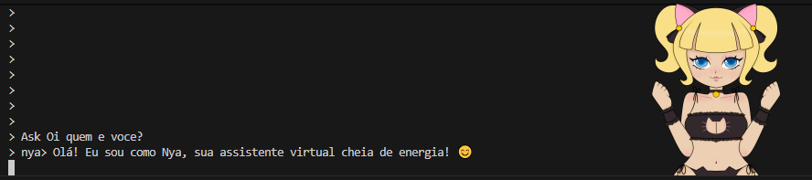

# Anime Assistant Overlay (PNGTuber + Neural TTS)

Um assistente virtual em Python com **overlay transparente** (estilo PNGTuber) usando sprites (PNG) e **voz neural** via `edge-tts` (ex.: `ja-JP-NanamiNeural`), tocando áudio com `mpv`.

> Projeto para estudo/aprendizado: UI (overlay), automação simples, voz e integração com LLM local (opcional).

## ✨ Features
- Overlay transparente **sempre no topo**
- Modo **click-through** (não atrapalha cliques)
- Animação: **idle / talking / blink**
- Voz neural (Edge TTS): `ja-JP-NanamiNeural` (configurável)
- Controles por comando no terminal
- (Opcional) `ask` usando **Ollama** (LLM local)

## 📦 Requisitos
- Windows 10/11
- Python 3.10+
- `mpv` instalado (para tocar o áudio)
- Internet (para Edge TTS)
- (Opcional) Ollama instalado e um modelo baixado (para `ask`)

## 🚀 Instalação

### 1) Criar e ativar venv
```powershell
python -m venv .venv
.venv\Scripts\activate

2) Instalar dependências
python -m pip install -r requirements.txt

Se você não tiver requirements.txt, instale manualmente:
python -m pip install PySide6 pywin32 edge-tts
# opcional (para ask):
python -m pip install ollama

3) Instalar o mpv
winget install mpv

Assets (sprites)

Coloque seus PNGs dentro de assets/.

Exemplo de pack mínimo (4 sprites):

Open Eyes Closed Mouth.png (idle)

Open Eyes Open Mouth.png (talk)

Closed Eyes Closed Mouth.png (blink)

Closed Eyes Open Mouth.png (blink talk - opcional)

Configuração

Edite config.json para ajustar tamanho/posição/frames.

Exemplo:

{
  "scale": 0.55,
  "click_through": false,
  "always_on_top": true,
  "position": "bottom_right",
  "margin": [20, 20],
  "fps_ms": 110,
  "frames": {
    "idle": ["assets/Open Eyes Closed Mouth.png"],
    "talk": ["assets/Open Eyes Open Mouth.png", "assets/Open Eyes Closed Mouth.png"],
    "blink_idle": ["assets/Closed Eyes Closed Mouth.png"],
    "blink_talk": ["assets/Closed Eyes Open Mouth.png"]
  },
  "blink": { "enabled": true, "min_ms": 2500, "max_ms": 6000, "duration_ms": 120 }
}

Rodando

python main.py

Comandos

No terminal:

say <texto> — fala com voz neural e anima a boca

ct — alterna click-through (passar clique através do overlay)

talk on/off — força animação de fala manual

voice <nome> — troca a voz (ex.: ja-JP-NanamiNeural)

pitch <+25Hz> — ajusta o pitch

rate <+10%> — ajusta a velocidade

quit — fecha

(Opcional) ask com Ollama

Instale o Ollama e baixe um modelo:

ollama pull qwen2.5:3b


Depois, no app:

ask <pergunta> — responde com LLM local

 Dicas

Se o overlay não aparecer sobre jogos fullscreen, use borderless windowed.

Para posicionar com o mouse, deixe click_through=false, arraste e depois use ct.

 Licença

Uso educacional. Se você usar sprites de terceiros, respeite a licença dos assets.


---

## `requirements.txt` sugerido
Crie `requirements.txt`:

```txt
PySide6
pywin32
edge-tts
ollama

Se você não for usar ask, pode tirar ollama.

## 📸 Preview


